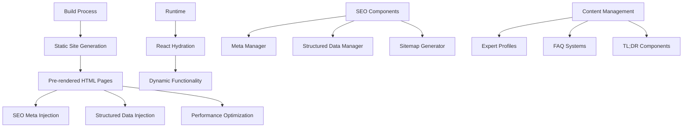
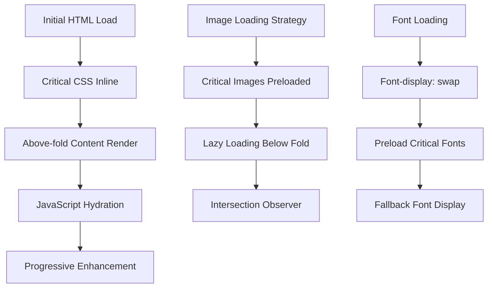
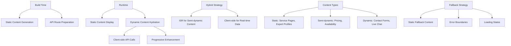
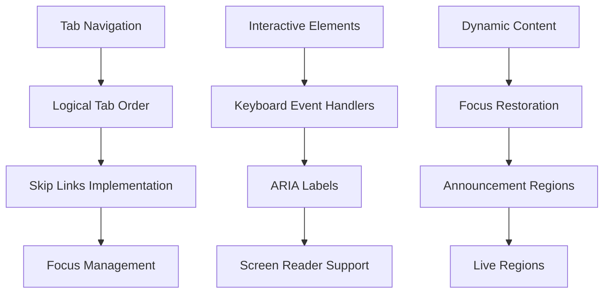

# Design Document

## Overview

This design implements comprehensive SEO and AIO optimization for the React/Vite-based recovery website. The current architecture uses client-side rendering (CSR) which creates SEO challenges as search engines receive empty HTML shells. The solution involves implementing Static Site Generation (SSG) using Vite's build capabilities, adding comprehensive structured data, creating SEO-optimized components, and implementing performance optimizations.

The design addresses the audit findings by transforming the current CSR application into an SEO-friendly SSG application while maintaining the existing React component architecture and user experience.

## Architecture

### Current Architecture Issues
- **Client-Side Rendering**: Empty HTML shells prevent proper search engine indexing
- **Missing Structured Data**: No JSON-LD schemas for business, services, or FAQs
- **Incomplete Meta Management**: Basic meta tags without page-specific optimization
- **No Sitemap Generation**: Missing automated sitemap and robots.txt generation
- **Performance Gaps**: Potential Core Web Vitals issues with LCP and CLS

### Proposed Architecture



### Technology Stack Integration
- **Build Tool**: Vite with SSG plugin for static generation
- **Meta Management**: React Helmet Async (already installed)
- **Routing**: React Router DOM with static route generation
- **Structured Data**: Custom JSON-LD components
- **Performance**: Existing optimization utilities enhanced

## Components and Interfaces

### 1. SEO Infrastructure Components

#### SEOHead Component
```typescript
interface SEOHeadProps {
  title: string;
  description: string;
  keywords?: string[];
  canonicalUrl?: string;
  ogImage?: string;
  structuredData?: object[];
  noindex?: boolean;
}
```

#### StructuredDataManager
```typescript
interface StructuredDataConfig {
  type: 'LocalBusiness' | 'Service' | 'FAQPage' | 'Person' | 'Article';
  data: Record<string, any>;
}
```

#### SitemapGenerator
```typescript
interface SitemapConfig {
  baseUrl: string;
  routes: RouteConfig[];
  changefreq: 'daily' | 'weekly' | 'monthly';
  priority: number;
}
```

### 2. Content Enhancement Components

#### ExpertProfile Component
```typescript
interface ExpertProfileProps {
  name: string;
  title: string;
  experience: string;
  certifications: string[];
  linkedinUrl?: string;
  image?: string;
  bio: string;
}
```

#### FAQSection Component
```typescript
interface FAQItem {
  question: string;
  answer: string;
  category?: string;
}

interface FAQSectionProps {
  items: FAQItem[];
  title?: string;
  structured?: boolean; // Generate FAQPage schema
}
```

#### TLDRBox Component
```typescript
interface TLDRBoxProps {
  points: string[];
  title?: string;
  className?: string;
}
```

### 3. Performance Components

#### ImageOptimizer Component
```typescript
interface OptimizedImageProps {
  src: string;
  alt: string;
  width?: number;
  height?: number;
  priority?: boolean;
  sizes?: string;
}
```

#### LazySection Component
```typescript
interface LazySectionProps {
  children: React.ReactNode;
  threshold?: number;
  rootMargin?: string;
}
```

## Data Models

### 1. SEO Configuration Model
```typescript
interface SEOConfig {
  site: {
    name: string;
    url: string;
    description: string;
    logo: string;
    social: {
      facebook?: string;
      twitter?: string;
      linkedin?: string;
    };
  };
  business: {
    name: string;
    address: {
      street: string;
      city: string;
      postalCode: string;
      country: string;
    };
    phone: string;
    email: string;
    hours: string;
    geo: {
      latitude: number;
      longitude: number;
    };
  };
  services: ServiceSchema[];
}
```

### 2. Service Schema Model
```typescript
interface ServiceSchema {
  id: string;
  name: string;
  description: string;
  category: string;
  price?: {
    currency: string;
    value: number;
    type: 'fixed' | 'starting-from';
  };
  duration?: string;
  availability: string;
  areaServed: string[];
}
```

### 3. Expert Profile Model
```typescript
interface ExpertProfile {
  id: string;
  name: string;
  title: string;
  bio: string;
  experience: {
    years: number;
    description: string;
  };
  certifications: Certification[];
  education: Education[];
  specialties: string[];
  contact: {
    linkedin?: string;
    email?: string;
  };
  image?: string;
}
```

### 4. FAQ Model
```typescript
interface FAQ {
  id: string;
  question: string;
  answer: string;
  category: string;
  serviceId?: string;
  keywords: string[];
  lastUpdated: string;
}
```

## Error Handling

### 1. Build-Time Error Handling
- **Missing Meta Data**: Fallback to default values with warnings
- **Invalid Structured Data**: Schema validation with error reporting
- **Image Optimization Failures**: Graceful degradation to original images
- **Sitemap Generation Errors**: Continue build with error logging

### 2. Runtime Error Handling
- **SEO Component Failures**: Silent fallbacks to prevent page breaks
- **Structured Data Errors**: Log errors without affecting user experience
- **Performance Monitoring**: Track and report Core Web Vitals issues

### 3. SEO Validation
- **Schema Validation**: Automated testing of JSON-LD schemas
- **Meta Tag Validation**: Ensure required tags are present
- **Sitemap Validation**: XML validation and accessibility testing
- **Performance Validation**: Automated Lighthouse testing

## Testing Strategy

### 1. SEO Testing
```typescript
// Example test structure
describe('SEO Components', () => {
  test('SEOHead generates correct meta tags', () => {
    // Test meta tag generation
  });
  
  test('Structured data is valid JSON-LD', () => {
    // Test schema validation
  });
  
  test('Sitemap includes all routes', () => {
    // Test sitemap completeness
  });
});
```

### 2. Performance Testing
- **Core Web Vitals**: Automated testing for LCP, CLS, FID
- **Bundle Size**: Monitor chunk sizes and loading performance
- **Image Optimization**: Verify WebP/AVIF generation and loading
- **Accessibility**: Automated a11y testing with existing tools

### 3. Integration Testing
- **Search Console Integration**: Verify sitemap submission
- **Structured Data Testing**: Google's Rich Results Test
- **Social Media Testing**: Open Graph and Twitter Card validation
- **Mobile Testing**: Mobile-friendly test and responsive design

### 4. Build Testing
- **Static Generation**: Verify all routes generate static HTML
- **Asset Optimization**: Confirm image and CSS optimization
- **Bundle Analysis**: Monitor bundle splitting and optimization
- **Deployment Testing**: Verify production build functionality

## Implementation Phases

### Phase 1: Infrastructure Setup
1. Configure Vite for static site generation
2. Implement SEOHead component with React Helmet
3. Create structured data management system
4. Set up sitemap and robots.txt generation

### Phase 2: Content Enhancement
1. Implement expert profile components and data
2. Create comprehensive FAQ systems for each service
3. Add TL;DR boxes to main pages
4. Optimize image components with proper alt text

### Phase 3: Performance Optimization
1. Implement Core Web Vitals improvements
2. Optimize bundle splitting and lazy loading
3. Enhance image optimization pipeline
4. Add performance monitoring

### Phase 4: Integration and Testing
1. Set up Search Console and Bing Webmaster integration
2. Implement comprehensive testing suite
3. Add monitoring and analytics
4. Deploy and validate production implementation

## Technical Considerations

### 1. Static Site Generation with Vite
- Use `vite-plugin-ssr` or custom build script for SSG
- Generate static HTML for all routes during build
- Maintain React hydration for dynamic functionality
- Ensure proper asset optimization and chunking

### 2. Progressive Loading Strategy
The implementation addresses LCP and CLS optimization through a multi-layered approach:



**LCP Optimization Techniques:**
- Preload hero images and critical above-the-fold content
- Inline critical CSS to prevent render-blocking
- Use resource hints (preconnect, dns-prefetch) for external resources
- Implement proper image sizing to prevent layout shifts

**CLS Prevention Strategies:**
- Reserve space for images using aspect-ratio CSS
- Use CSS containment for dynamic content areas
- Implement skeleton loading states for dynamic content
- Avoid inserting content above existing content

### 3. Dynamic Content Handling in SSG



**Dynamic Content Strategy:**
- **Static Content**: Service descriptions, expert profiles, FAQ content generated at build time
- **Semi-dynamic Content**: Use Incremental Static Regeneration (ISR) for content that changes occasionally
- **Real-time Content**: Contact forms, pricing updates, availability status loaded client-side
- **Fallback Strategy**: Provide static fallbacks for all dynamic content to ensure SEO visibility

### 4. Structured Data Strategy
- Implement JSON-LD injection at build time
- Create reusable schema components
- Validate schemas against Google's guidelines
- Support multiple schema types per page

### 5. Advanced Performance Optimization

#### Font Loading Strategy
```typescript
// Font loading optimization implementation
const fontLoadingStrategy = {
  critical: ['Heebo-Regular', 'Heebo-Bold'], // Hebrew fonts
  preload: true,
  display: 'swap',
  fallback: 'system-ui, -apple-system, sans-serif'
};
```

#### Image Optimization Pipeline
```typescript
// Responsive image implementation
interface ResponsiveImageConfig {
  src: string;
  srcSet: string; // Multiple resolutions
  sizes: string;  // Responsive breakpoints
  loading: 'lazy' | 'eager';
  decoding: 'async' | 'sync';
}
```

### 6. Comprehensive Accessibility Integration

#### Color Contrast Requirements
- **WCAG AA Compliance**: Minimum contrast ratio of 4.5:1 for normal text
- **WCAG AAA Compliance**: Minimum contrast ratio of 7:1 for enhanced accessibility
- **Large Text**: Minimum contrast ratio of 3:1 for text 18pt+ or 14pt+ bold
- **Automated Testing**: Implement axe-core integration for continuous contrast monitoring

#### Keyboard Navigation Strategy


**Keyboard Navigation Requirements:**
- All interactive elements must be keyboard accessible
- Implement skip links for main content areas
- Maintain logical tab order throughout the application
- Provide visible focus indicators with sufficient contrast
- Handle focus management for dynamic content and modals

#### ARIA Implementation Strategy
- **Semantic HTML First**: Use proper HTML elements before adding ARIA
- **ARIA Labels**: Provide descriptive labels for complex interactions
- **Live Regions**: Announce dynamic content changes to screen readers
- **Landmark Roles**: Ensure proper page structure with navigation landmarks

### 7. Caching Strategy

#### Netlify Caching Headers Configuration
```typescript
// _headers file configuration
const cachingStrategy = {
  staticAssets: {
    'Cache-Control': 'public, max-age=31536000, immutable',
    files: ['*.js', '*.css', '*.woff2', '*.webp']
  },
  htmlPages: {
    'Cache-Control': 'public, max-age=3600, s-maxage=86400',
    files: ['*.html']
  },
  apiRoutes: {
    'Cache-Control': 'public, max-age=300, s-maxage=600',
    files: ['/api/*']
  }
};
```